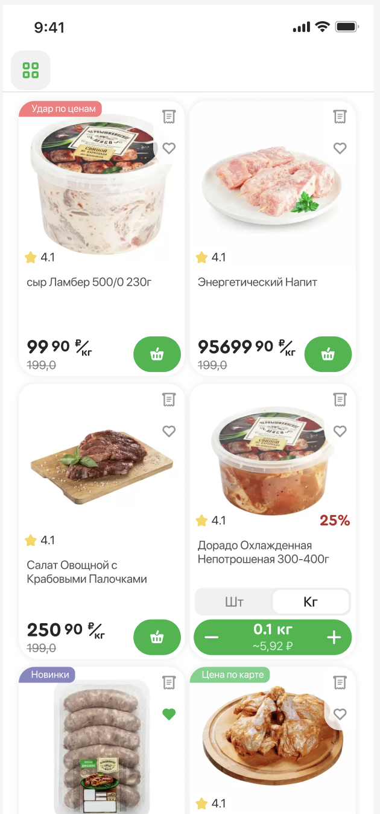
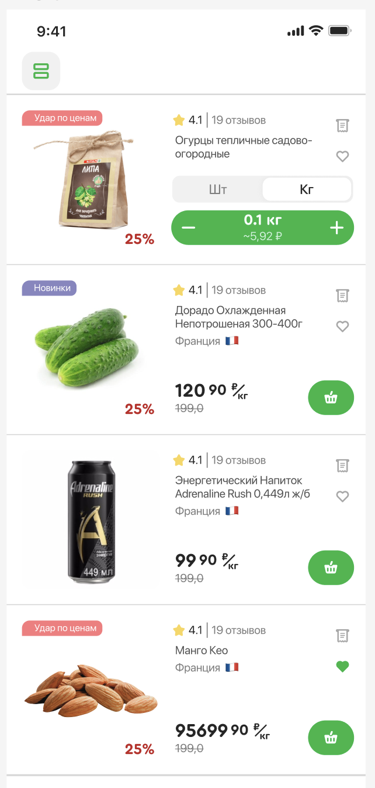

# T1_SparSwiftUI
Это тестовое задание уровня Интерн.
Необходимо:
Реализовать экран списка товаров из дизайна по ссылке:
https://www.figma.com/design/1VrYJ62cSC7yFJWsuUD3xa/Spar-Intern-Task?node-id=0-1&t=SuQD6RjUqoX4pPUF-1

Для отображения данных используем МОК-модельки

Экраны:
Один экран в двух состояниях
Экран списка товаров в режиме отображения Grid

Экран списка товаров в режиме отображения List

Для реализации тестового задания используем фреймворк SwiftUI. 
Архитектурный паттерн MVVM

